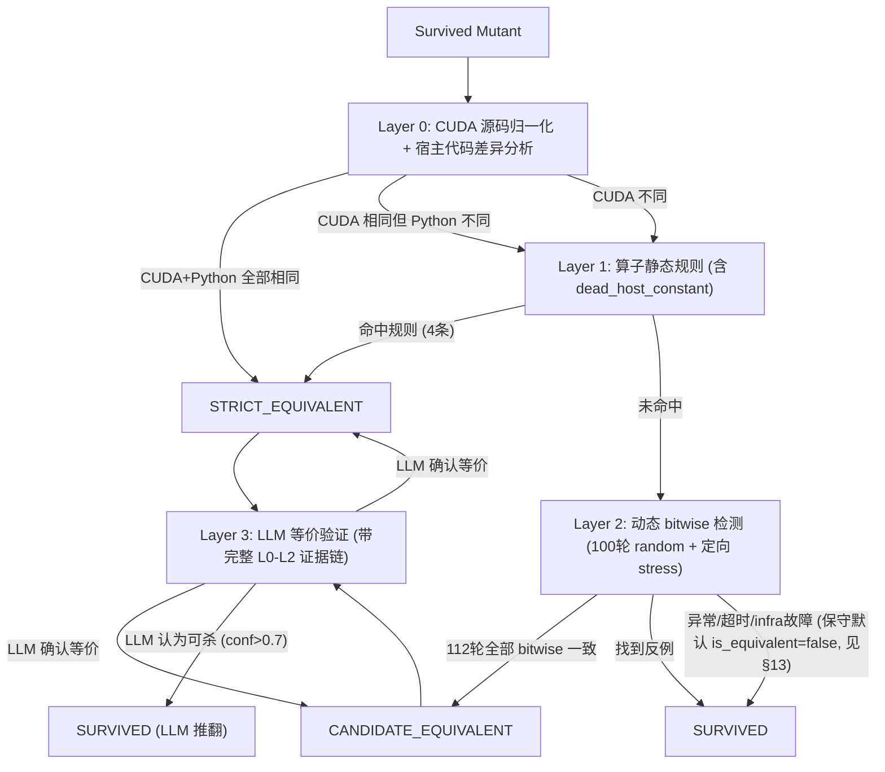

# MutaKernel 等价变异体检测 V2 重构方案

> 基于第一次实验的等价判定问题分析，结合变异测试文献（TCE、EMS、State Infection）和 GPT-5.4 / Opus 4.6 的技术讨论，制定本方案。

## 架构总览



### 设计原则

1. **精度优先于召回**: 误标等价会终止后续增强测试，代价远高于漏检等价
2. **分层递进**: 越便宜的方法越先跑，越重的方法只给难例
3. **证据分级**: 不同强度的等价证据对应不同标签，不混为一谈
4. **单向安全**: LLM 只能推翻等价判定（等价→survived），不能反向确认（survived→等价）
5. **固定 shape、变值**: 输入 tensor 的 shape/dtype 固定来自 reference 的 `get_inputs()`，只有数值可变
6. **不短路**: `cuda_eq=True, py_eq=False` 时不再跳过 Layer 1/2，必须经过静态规则和动态验证

---

## 一、状态模型重构

### 1.1 修改 `MutantStatus` 枚举

**文件:** `src/models.py` (第 12-18 行)

当前状态：
```python
class MutantStatus(Enum):
    PENDING = "pending"
    KILLED = "killed"
    SURVIVED = "survived"
    STILLBORN = "stillborn"
    EQUIVALENT = "equivalent"    # ← 移除
    TIMEOUT = "timeout"
```

修改为：
```python
class MutantStatus(Enum):
    PENDING = "pending"
    KILLED = "killed"
    SURVIVED = "survived"
    STILLBORN = "stillborn"
    STRICT_EQUIVALENT = "strict_equivalent"      # 强证据 (文本归一化/静态规则)
    CANDIDATE_EQUIVALENT = "candidate_equivalent" # 动态未观测到差异
    UNKNOWN = "unknown"                           # 异常/超时/infra 故障
    TIMEOUT = "timeout"
```

### 1.2 修改 mutation score 计算

**文件:** `src/models.py` (第 128-177 行)

- `mutation_score`（保守口径）分母只排除 `STILLBORN + STRICT_EQUIVALENT`
- 新增 `mutation_score_optimistic` 额外排除 `CANDIDATE_EQUIVALENT`
- `equivalent` 属性拆分为 `strict_equivalent` 和 `candidate_equivalent` 两个属性
- `score_by_category` 和 `score_by_operator` 的分母逻辑同步更新

```python
@property
def strict_equivalent(self) -> int:
    return sum(1 for m in self.mutants if m.status == MutantStatus.STRICT_EQUIVALENT)

@property
def candidate_equivalent(self) -> int:
    return sum(1 for m in self.mutants if m.status == MutantStatus.CANDIDATE_EQUIVALENT)

@property
def mutation_score(self) -> float:
    """保守口径: 只排除 STRICT_EQUIVALENT"""
    denom = self.total - self.stillborn - self.strict_equivalent
    if denom <= 0:
        return 0.0
    return self.killed / denom

@property
def mutation_score_optimistic(self) -> float:
    """乐观口径: 额外排除 CANDIDATE_EQUIVALENT"""
    denom = self.total - self.stillborn - self.strict_equivalent - self.candidate_equivalent
    if denom <= 0:
        return 0.0
    return self.killed / denom
```

### 1.3 向后兼容

- `from_dict` 读到旧的 `"equivalent"` 字符串时映射为 `CANDIDATE_EQUIVALENT`
- 旧结果 JSON 可正常加载
- 新运行产出的结果使用新状态值

### 1.4 涉及状态的全部引用点

需要同步更新所有使用 `MutantStatus.EQUIVALENT` 的位置：

| 文件 | 行号 |
|------|------|
| `src/mutengine/equivalent_detector.py` | 161, 177 |
| `src/mutengine/report.py` | 52-116 |
| `scripts/full_block12.py` | 320, 328, 335 |
| `scripts/smoke_block12.py` | 232 |
| `scripts/smoke_cd.py` | 230 |
| `scripts/smoke_cd2.py` | 245 |

---

## 二、Layer 0: CUDA 源码级归一化 + 宿主代码差异分析

### 2.1 问题

原始 `_normalize_source` 只做 Python 级归一化，对嵌入的 CUDA C++ 字符串无效。

### 2.2 方案

双层归一化 + 宿主代码差异分析：

1. 用 `CudaParser` 提取 CUDA 字符串块，C++ 级归一化后比较
2. 对 Python 宿主代码（ModelNew、模块级常量等）归一化比较
3. **新增**: 当 `cuda_eq=True, py_eq=False` 时，调用 `_analyze_host_diff()` 分析：
   - 变异位于模块级 / class 内部 / 函数内部
   - 被变异的变量名
   - 该变量是否被 `ModelNew.__init__()` / `forward()` 引用
   - 该变量是否只被 `get_inputs()` / `get_init_inputs()` 引用

### 2.3 关键流程变更

**V2.1 修正**: `cuda_eq=True, py_eq=False` **不再短路判定为 CANDIDATE**。改为：
- 记录证据（包含 `host_diff_analysis`）
- 继续到 Layer 1（静态规则可能判定为 STRICT）
- 继续到 Layer 2（动态验证可能发现实际差异）

这修复了之前的问题：`const_perturb` 改 `N=2048→2049` 时，如果 `forward()` 确实使用了 `N` 来 launch kernel grid，Layer 2 的动态测试可以发现输出差异；而之前直接跳过了动态测试。

### 2.4 判定结果

| 条件 | 判定 | 后续 |
|------|------|------|
| `cuda_eq=True, py_eq=True` | **STRICT_EQUIVALENT** | 跳过 L1/L2，直接到 L3 LLM |
| `cuda_eq=True, py_eq=False` | 记录证据，不判定 | 继续 L1 → L2 → L3 |
| `cuda_eq=False` | 不等价证据 | 继续 L1 → L2 → L3 |

---

## 三、Layer 1: 算子静态规则

### 3.1 新增模块

**文件:** `src/mutengine/static_equiv_rules.py`

包含 **4 条** 针对 CUDA kernel / 宿主代码的静态规则：

### 规则 1: boundary_unreachable

**适用算子:** `relop_replace`, `mask_boundary`

在 CUDA 中，`threadIdx.x` 的范围是 `[0, blockDim.x-1]`。如果变异将 `threadIdx.x < blockDim.x` 改为 `threadIdx.x <= blockDim.x`，由于 `threadIdx.x` 永远到不了 `blockDim.x`，两者语义完全相同。

### 规则 2: dead_write

**适用算子:** `arith_replace`, `const_perturb`, `scale_modify`, `init_modify`

变异修改了一个赋值语句的右侧值，但该变量在下一次被读取前就被重新赋值了。

### 规则 3: mask_noreach

**适用算子:** `mask_boundary`

mask 边界收紧（`idx < n` → `idx < n-1`）只影响 padding 区域的线程。

### 规则 4: dead_host_constant（V2.1 新增）

**适用算子:** `const_perturb`

**核心原理**: 在固定 shape 测试框架下，`get_inputs()` / `get_init_inputs()` 始终来自 **reference** 模块，而非变异体。如果 `const_perturb` 修改了一个模块级常量（如 `N = 2048 → 2049`），且这个常量 **不被 `ModelNew` 的任何方法引用**（只被 `get_inputs()` 使用），那么这个变异是死代码。

**实现**:
1. 用 Python AST 解析变异后代码
2. 确认变异行在模块级（不在任何 class / function 内部）
3. 找到被赋值的变量名
4. AST 遍历 `ModelNew` / `Model` 类，检查是否有对该变量的引用
5. 如果无引用 → `STRICT_EQUIVALENT`

```python
# 典型触发场景:
N = 2048   # ← const_perturb 改为 2049
def get_inputs():
    return [torch.randn(N, N)]  # 只有 get_inputs 用了 N
class ModelNew(nn.Module):
    def forward(self, A, B):
        return self.ext.cuda_func(A, B)  # forward 不用 N → 死代码
```

### 3.2 集成点

在 `EquivalentDetector.classify_survived_mutants` 中，Layer 0 和 Layer 2 之间调用：

```python
# Layer 0
if self.check_textual_equivalence(m):
    m.status = MutantStatus.STRICT_EQUIVALENT
    m.error_message = "Textually equivalent (CUDA-aware normalization)"
    continue

# Layer 1
rule_hit = self.check_static_rules(m)
if rule_hit:
    m.status = MutantStatus.STRICT_EQUIVALENT
    m.error_message = f"Static rule: {rule_hit}"
    continue

# Layer 2
if self.check_statistical_equivalence(...):
    m.status = MutantStatus.CANDIDATE_EQUIVALENT
    m.error_message = f"Statistically equivalent ({self.num_runs} random + stress)"
```

---

## 四、Layer 2: 动态检测修复

### 4.1 结构化异常处理

**文件:** `src/mutengine/equivalent_detector.py` (第 83-137 行)

新增比较结果枚举：

```python
class CompareResult(Enum):
    SAME_OUTPUT = "same_output"
    DIFFERENT_OUTPUT = "different_output"
    SAME_EXCEPTION = "same_exception"
    DIFFERENT_EXCEPTION = "different_exception"
    ONE_SIDE_EXCEPTION = "one_side_exception"
    INFRA_ERROR = "infra_error"
```

**关键修复:** 压力阶段不再 `except Exception: pass`，改为：

| 场景 | 判定 |
|------|------|
| 两边都成功，输出相同 | `SAME_OUTPUT`（通过） |
| 两边都成功，输出不同 | `DIFFERENT_OUTPUT`（反例） |
| 一边异常一边成功 | `ONE_SIDE_EXCEPTION`（反例，判非等价） |
| 两边都异常且类型相同 | `SAME_EXCEPTION`（算通过） |
| 两边都异常但类型不同 | `DIFFERENT_EXCEPTION`（反例） |
| CUDA OOM 等基础设施问题 | `INFRA_ERROR`（标记 UNKNOWN） |

### 4.2 NaN-aware bitwise 比较

**文件:** `src/mutengine/equivalent_detector.py` (第 34-44 行)

修改 `_bitwise_identical`，对浮点 tensor 先比较 NaN 位置是否一致，再比较非 NaN 值：

```python
def _bitwise_identical(a, b):
    if isinstance(a, torch.Tensor) and isinstance(b, torch.Tensor):
        if a.shape != b.shape or a.dtype != b.dtype:
            return False
        if a.is_floating_point():
            nan_mask_a = torch.isnan(a)
            nan_mask_b = torch.isnan(b)
            if not torch.equal(nan_mask_a, nan_mask_b):
                return False
            finite_mask = ~nan_mask_a
            if finite_mask.any():
                return torch.equal(a[finite_mask], b[finite_mask])
            return True  # both all-NaN at same positions
        return torch.equal(a, b)
    if isinstance(a, (tuple, list)) and isinstance(b, (tuple, list)):
        if len(a) != len(b):
            return False
        return all(_bitwise_identical(x, y) for x, y in zip(a, b))
    return a == b
```

### 4.3 Layer 2 的结果分类与 Phase 2 增强测试的关系

#### 4.3.1 Layer 2 只产出两种结果（不产出 KILLED）

Layer 2 的 112 轮动态 bitwise 检测只有两种输出：

| Layer 2 结果 | 条件 | 输出状态 | 后续 |
|---|---|---|---|
| **CANDIDATE_EQUIVALENT** | 112 轮全部 bitwise 一致 | `CANDIDATE_EQUIVALENT` | 进入 Layer 3 LLM 审查 |
| **SURVIVED（不等价）** | 任意一轮 bitwise 不同（找到反例） | `SURVIVED` | 保持 SURVIVED，进入 Phase 2 增强测试 |
| **SURVIVED（异常）** | 超时/infra 故障（保守默认） | `SURVIVED` | 保持 SURVIVED，进入 Phase 2 增强测试 |

**Layer 2 不产出 KILLED 状态。** 即使 Layer 2 找到了 mutant 与 original 输出不同的反例，也只将 mutant 标记为 SURVIVED（不等价），而不是 KILLED。

#### 4.3.2 为什么 Layer 2 发现差异 ≠ KILLED？

Layer 2 确实使用了与 Phase 2 增强测试相同的 `policy_bank` 中的算子定向策略（`near_zero`, `large_magnitude`, `structured_ramp` 等），从功能上看很像一次"预增强测试"。但 Layer 2 找到反例与 Phase 2 杀死变异体之间存在关键区别：

**1. 比较标准不同：**

| 阶段 | 比较方法 | 精度 |
|---|---|---|
| Phase 1 初始测试（杀死判定） | `allclose`（容差比较，atol/rtol ≈ 1e-2） | 宽松 |
| EMD Layer 2（等价检测） | `_bitwise_identical`（位级精确比较） | 严格 |
| Phase 2 增强测试（杀死判定） | `allclose`（容差比较，atol/rtol = 1e-2） | 宽松 |

Layer 2 使用 **bitwise 比较**，而 Phase 1 和 Phase 2 的杀死判定使用 **allclose 容差比较**。因此存在一个灰色地带：

```
mutant 输出 ≈ original 输出 (allclose 通过)  → Phase 1 判定 SURVIVED
mutant 输出 ≠ original 输出 (bitwise 不同)   → Layer 2 判定"不等价"
```

这类变异体产生了**微小但存在的数值差异**（如浮点误差传播导致的 1e-6 级别差异），Phase 1 的容差容忍了它，但 Layer 2 的 bitwise 比较检测到了。bitwise 差异可能只是 GPU 浮点运算的非确定性噪声，不代表语义层面的错误，因此不能直接判定为 KILLED。

**2. 语义角色不同：**

- **Layer 2 的角色**：回答"这个变异体是否等价于原始代码？"——是等价性判定
- **Phase 2 的角色**：回答"能否找到一个测试用例杀死这个变异体？"——是杀死判定

找到 bitwise 不同说明变异体**不等价**（可以被区分），但不等于它在当前测试框架的容差下能被**杀死**。

#### 4.3.3 Layer 2 "反例"在 Phase 2 中的价值

Layer 2 的反例不是被浪费的——它直接驱动了 Phase 2 的 Tier 分级策略：

```python
def classify_tier(mutant_meta: dict) -> int:
    status = mutant_meta.get("status", "survived")
    ed = mutant_meta.get("equiv_detail", {})
    if status == "candidate_equivalent":
        return 3  # Layer 2 全通过 → 最可能等价
    l2 = ed.get("layer2", {})
    if l2 and l2.get("is_equivalent") is False:
        return 1  # Layer 2 找到差异 → 最可能可杀
    return 2
```

- **Tier 1**（Layer 2 拒绝等价）：kill rate **84.8%** —— 最高
- **Tier 2**（LLM 拒绝等价）：kill rate 中等
- **Tier 3**（Candidate Equivalent）：kill rate **7.9%** —— 最低

Phase 2 的 `tier1_replay` 维度会**重放 Layer 2 的反例输入**，尝试在 allclose 比较下杀死变异体。Tier 1 的高杀死率验证了 Layer 2 反例的价值。

#### 4.3.4 设计总结

```
Layer 2 发现 bitwise 差异
  ├─ 差异在 allclose 容差内 → Phase 2 tier1_replay 无法杀死
  │   └─ 但 Phase 2 其他维度 (value_stress 等) 可能放大差异 → 杀死
  └─ 差异超出 allclose 容差 → Phase 2 tier1_replay 直接杀死
```

Layer 2 和 Phase 2 的分工是：Layer 2 用严格标准（bitwise）**筛选**哪些变异体值得深入测试，Phase 2 用统一标准（allclose）**判定**变异体是否被杀死。两者使用相同的 stress policy，但比较精度不同，互为补充。

### 4.4 子进程 worker 同步修复

需要同步修改的子进程 worker（它们运行在子进程中，不导入 `equivalent_detector.py`，需独立修改）：

| 文件 | 修改内容 |
|------|---------|
| `scripts/_mutant_worker.py` (第 28-38, 97-210 行) | `_bitwise_identical` NaN 修复 + `_equiv_mode` 异常处理 |
| `scripts/_equiv_check_one.py` (第 34-44, 102-139 行) | `_bitwise_identical` NaN 修复 + 主循环异常处理 |
| `scripts/_equiv_batch_worker.py` (第 37-47, 125-160 行) | `_bitwise_identical` NaN 修复 + 批量循环异常处理 |

---

## 五、算子定向输入策略

### 5.1 扩展 policy_bank

**文件:** `src/stress/policy_bank.py`

在现有 14 个通用策略基础上追加算子定向策略：

| 策略名 | 目标算子 | 输入特征 |
|--------|---------|---------|
| `relop_boundary_hit` | `relop_replace` | 构造让关键比较值恰好相等的 tensor 元素 |
| `extreme_magnitude` | `arith_replace`, `scale_modify` | 比 `large_magnitude` 更极端（1e6 级别） |
| `near_epsilon` | `epsilon_modify` | 所有值在 1e-7 ~ 1e-5 范围 |
| `reduction_adversarial` | `acc_downgrade`, `reduction_reorder` | 大正值+大负值交替，最大化浮点累积误差 |
| `init_sensitive` | `init_modify` | 全正值（让 min 初始值关键）或全负值（让 max 初始值关键） |

### 5.2 等价检测中的策略选择

在等价检测的 stress 阶段，根据 mutant 的 `operator_name` 选择对应的定向策略，而非固定使用 6 个通用策略：

```python
OPERATOR_DIRECTED_POLICIES = {
    "relop_replace": ["relop_boundary_hit", "boundary_last_element", "structured_ramp"],
    "arith_replace": ["extreme_magnitude", "large_magnitude", "near_zero"],
    "epsilon_modify": ["near_epsilon", "near_zero", "denormals"],
    "mask_boundary": ["boundary_last_element", "structured_ramp", "head_heavy", "tail_heavy"],
    "index_replace": ["head_heavy", "tail_heavy", "structured_ramp"],
    "stab_remove": ["extreme_magnitude", "large_magnitude", "all_positive"],
    "scale_modify": ["extreme_magnitude", "large_magnitude", "near_zero"],
    "acc_downgrade": ["reduction_adversarial", "large_magnitude", "mixed_extremes"],
    "reduction_reorder": ["reduction_adversarial", "mixed_extremes", "alternating_sign"],
    "init_modify": ["init_sensitive", "all_negative", "all_positive", "sparse"],
    "cast_remove": ["extreme_magnitude", "near_zero", "mixed_extremes"],
    "sync_remove": ["structured_ramp", "head_heavy", "tail_heavy"],
    "const_perturb": ["near_zero", "boundary_last_element", "sparse"],
    "launch_config_mutate": ["structured_ramp", "head_heavy", "tail_heavy"],
    "broadcast_unsafe": ["large_magnitude", "sparse", "mixed_extremes"],
    "layout_assume": ["structured_ramp", "alternating_sign"],
    "_default": ["large_magnitude", "near_zero", "structured_ramp",
                  "all_negative", "sparse", "boundary_last_element"],
}
```

论文中可表述为"受 state infection condition 启发的算子定向输入生成策略"。

---

## 六、Layer 3: LLM 等价验证（二次审查）

### 6.1 设计动机

前三层自动化检测完成后，所有被标记为 `STRICT_EQUIVALENT` 或 `CANDIDATE_EQUIVALENT` 的变异体都经过一次 LLM 审查。目标是**捕获 false-equivalent**（被误判为等价的非等价变异体），因为这类误判会终止后续增强测试，代价最高。

### 6.2 传递给 LLM 的信息（V2.1 增强版）

| 信息段 | 来源 | V2.1 新增 |
|--------|------|----------|
| 原始/变异代码 + diff 标注 | `_extract_context()` | |
| 变异算子名称和语义描述 | `OPERATOR_DESCRIPTIONS` | |
| **Layer 0 证据**: CUDA/Python 相同/不同 | `equiv_detail["layer0"]` | |
| **Layer 0 宿主差异分析**: 变异位置、变量名、是否被 ModelNew 引用 | `host_diff_analysis` | ✅ 新增 |
| **Layer 1 证据**: 命中了哪条规则 / 未命中 | `equiv_detail["layer1"]` | |
| **Layer 1 规则说明**: dead_host_constant 等规则的文字解释 | 内置规则描述表 | ✅ 新增 |
| **Layer 2 证据**: 测试轮数、算子、bitwise 结果、CUDA 是否相同 | `equiv_detail["layer2"]` | `cuda_was_identical` ✅ 新增 |
| **测试原则声明**: 固定 shape、变值、bitwise 比较 | prompt 正文 | ✅ 新增 |
| **实际 input 规格**: `forward()` 参数数量、每个 tensor 的 shape/dtype | `_extract_input_spec()` | ✅ 新增 |

### 6.3 Prompt 核心改进

1. **明确声明测试原则**: 输入 shape 固定，只能变值；batch_size 也固定
2. **告诉 LLM 不要建议改 shape**: "Do NOT suggest changing input shapes, dimensions, or batch size"
3. **区分"执行路径上的变异"与"死代码变异"**: 如果变异不在执行路径上，确认等价
4. **传入 host_diff_analysis**: LLM 可以看到变异的变量名、是否被 ModelNew 使用
5. **传入真实 input spec**: 从 reference 的 `get_inputs()` 实际调用获取 shape/dtype

### 6.3 审查逻辑

```python
def verify_equivalent_with_llm(mutant, kernel, equiv_layer, equiv_evidence, input_spec):
    prompt = build_equiv_verify_prompt(
        kernel_code=kernel.kernel_code,
        mutated_code=mutant.mutated_code,
        operator_name=mutant.operator_name,
        site=mutant.site,
        equiv_level="STRICT_EQUIVALENT" if is_strict else "CANDIDATE_EQUIVALENT",
        equiv_evidence=equiv_evidence,
        input_spec=input_spec,
    )
    response = call_llm(prompt)
    result = parse_llm_response(response)

    if result["verdict"] == "possibly_killable" and result.get("suggested_test"):
        # 用 LLM 建议的输入实际跑一次验证
        actually_killed = run_llm_suggested_input(mutant, kernel, result["suggested_test"])
        if actually_killed:
            mutant.status = MutantStatus.KILLED
            mutant.error_message = "Killed by LLM-suggested input (equiv verify)"
            return

    if result["verdict"] == "possibly_killable" and result["confidence"] > 0.7:
        # LLM 高置信度认为可杀 → 回退为 SURVIVED
        mutant.status = MutantStatus.SURVIVED
        mutant.error_message = f"Equiv reverted by LLM: {result['reasoning'][:200]}"
```

### 6.4 关键设计决策

1. **LLM 只能推翻等价判定（等价→survived），不能反向确认（survived→等价）**。保证 false-equivalent 方向的安全性
2. **对 STRICT_EQUIVALENT 的审查是可选的**（Layer 0/1 有较强证据），主要针对 CANDIDATE_EQUIVALENT
3. **如果 LLM 给出了 kill 策略，先实际跑一次验证**：真的杀死→直接 KILLED；没杀死→保持原判定
4. **LLM 审查结果记录在 mutant 的 metadata 中**，供后续分析和论文写作
5. **置信度阈值 0.7**：LLM 不够确信时不推翻，避免 LLM 自身的 false positive

---

## 七、超时参数调整

**文件:** `scripts/full_block12.py` (第 59-60 行)

```python
MUTANT_TIMEOUT = 180   # 保持 3 min
EQUIV_TIMEOUT = 600    # 从 300s (5min) → 600s (10min)
```

等价检测需要编译 2 个 CUDA kernel + 100 轮随机 + 12 轮压力，CUDA 编译本身可能需要 30-60 秒，10 分钟更合理。

同步修改 `scripts/_equiv_check_one.py` 和 `scripts/recheck_equiv_v2.py` 中的对应超时值。

---

## 八、报告系统更新

### 8.1 MutationReporter 更新

**文件:** `src/mutengine/report.py`

- 汇总统计中拆分 `total_equivalent` 为 `total_strict_equivalent` 和 `total_candidate_equivalent`
- Markdown 报告展示两种口径的 mutation score
- 新增一列 "Equiv Evidence" 说明每个等价体的判定层次
- 新增 LLM 审查结果（推翻数量、确认数量）

### 8.2 Mutation Score 报告方式

```
Raw Score          = killed / (total - stillborn)
Conservative Score = killed / (total - stillborn - strict_equivalent)
Optimistic Score   = killed / (total - stillborn - strict_equivalent - candidate_equivalent)
```

论文主表用 **Conservative Score**，补充材料报告三种口径。

---

## 九、完整文件修改清单

| 文件 | 修改类型 | 主要内容 |
|------|---------|---------|
| `src/models.py` | 修改 | 状态枚举重构、score 计算、序列化兼容、`equiv_detail` 字段 |
| `src/mutengine/equivalent_detector.py` | 大改 | 四层检测流水线、CompareResult、NaN 处理、**`_analyze_host_diff()` 宿主差异分析** |
| `src/mutengine/static_equiv_rules.py` | **新建** | **4 条**算子静态规则 (含 `dead_host_constant`) |
| `src/mutengine/report.py` | 修改 | 汇总统计拆分、Markdown 双口径、LLM 审查结果 |
| `src/mutengine/__init__.py` | 修改 | 导出新模块 |
| `src/stress/policy_bank.py` | 修改 | 新增 5 个算子定向策略 |
| `src/stress/llm_analyzer.py` | 修改 | **EQUIV_VERIFY_PROMPT 含测试原则声明**、`_format_layer_evidence()` 含 host_diff 信息 |
| `scripts/full_block12.py` | 修改 | **L0 不短路**、`_extract_input_spec()` 传真实 shape/dtype、`_analyze_host_diff` 证据采集 |
| `scripts/_mutant_worker.py` | 修改 | bitwise NaN 修复、异常处理、算子定向策略 |
| `scripts/_equiv_check_one.py` | 修改 | bitwise NaN 修复、异常处理、超时 |
| `scripts/_equiv_batch_worker.py` | 修改 | bitwise NaN 修复、异常处理 |
| `scripts/smoke_block12.py` | 修改 | 状态引用更新 |
| `scripts/smoke_cd.py` | 修改 | 状态引用更新 |
| `scripts/smoke_cd2.py` | 修改 | 状态引用更新 |

---

## 十、论文各章节对应表述

| 章节 | 内容 |
|------|------|
| **方法设计** | "分层等价筛查策略：CUDA 源码归一化→算子静态规则→动态 bitwise 验证→LLM 二次审查。只有前两层（有强证据）产出 strict equivalent；动态层产出 candidate equivalent；LLM 层做最终的 false-equivalent 拦截。" |
| **实验设计** | 报告三种口径 mutation score；消融实验展示各层贡献；LLM 推翻率统计 |
| **Threats to Validity** | "等价检测本质上不可判定。我们的 strict equivalent 限于文本/静态规则可证明的情形；candidate equivalent 是启发式结果。动态检测基于输出等价，不覆盖 data race 和 barrier divergence 等并行行为属性。LLM 验证受模型能力限制，置信度阈值的选择可能影响推翻率。" |
| **Future Work** | "GPU kernel 的形式化等价验证（如 VOLTA）；nvcc PTX 产物级 TCE 比较；mutation-centered slice 级约束求解；LLM/嵌入模型作为等价候选排序器的训练与优化" |

---

## 十一、实施优先级

| 优先级 | 任务 | 状态 | 工作量 | 价值 |
|--------|------|------|--------|------|
| **P0** | 状态枚举重构 + score 计算 | ✅ 已完成 | 小 | 高 |
| **P0** | 修复异常处理 bug（CompareResult） | ✅ 已完成 | 小 | 高 |
| **P0** | 修复 `_bitwise_identical` NaN 处理 | ✅ 已完成 | 小 | 中 |
| **P1** | Layer 0 CUDA 源码归一化 | ✅ 已完成 | 中 | 高 |
| **P1** | **Layer 0 不短路 + 宿主差异分析** | ✅ V2.1 | 中 | **高** |
| **P1** | Layer 1 算子静态规则（3→**4** 条，含 dead_host_constant） | ✅ V2.1 | 中 | **高** |
| **P1** | 算子定向输入策略 | ✅ 已完成 | 中 | 高 |
| **P1** | Layer 3 LLM 等价验证 | ✅ 已完成 | 中 | 高 |
| **P1** | **LLM prompt 加入测试原则 + 真实 shape/dtype** | ✅ V2.1 | 中 | **高** |
| **P1** | **`_format_layer_evidence` 传递 host_diff + 规则说明** | ✅ V2.1 | 中 | **高** |
| **P2** | 报告系统更新 | ✅ 已完成 | 小 | 中 |
| **P2** | 超时参数调整 | ✅ 已完成 | 小 | 中 |
| **P2** | 子进程 worker 同步修改 | ✅ 已完成 | 中 | 中 |
| **P3** | smoke 脚本状态引用更新 | ✅ 已完成 | 小 | 低 |

---

## 十二、V2.1 修正记录（基于第二次实验反馈）

### 12.1 发现的问题

1. **Layer 0 短路 bug**: `cuda_eq=True, py_eq=False` 直接设 CANDIDATE_EQUIVALENT 并跳过 L1/L2，导致 `const_perturb` 改 `N=2048→2049` 时缺少动态验证
2. **缺少 `dead_host_constant` 规则**: 对于变异体模块级常量（只被 `get_inputs()` 使用、不被 `forward()` 使用）的情况，没有静态规则识别
3. **LLM prompt 缺乏测试原则**: LLM 不知道 "shape 固定、只能变值" 的约束，建议了无法执行的 kill 策略（改 shape/N）
4. **LLM 缺少实际 input spec**: `input_spec="fixed shape from get_inputs()"` 是一个占位符，LLM 看不到真实的 shape/dtype
5. **LLM 缺少 host_diff 分析**: LLM 不知道被变异的常量是否在 ModelNew 中使用

### 12.2 修复措施

| 问题 | 修复 | 涉及文件 |
|------|------|---------|
| L0 短路 | `cuda_eq=T, py_eq=F` 不设 `decided=True`，继续到 L1/L2 | `scripts/full_block12.py` |
| 缺规则 | 新增 `dead_host_constant`（AST 分析模块级常量引用） | `src/mutengine/static_equiv_rules.py` |
| LLM 无测试原则 | EQUIV_VERIFY_PROMPT 新增 "Testing Principle" 段落 | `src/stress/llm_analyzer.py` |
| LLM 无 input spec | `_extract_input_spec()` 从 reference 调 `get_inputs()` 获取真实 shape/dtype | `scripts/full_block12.py` |
| LLM 无 host_diff | `_analyze_host_diff()` + `_format_layer_evidence()` 格式化传递 | `src/mutengine/equivalent_detector.py`, `src/stress/llm_analyzer.py` |

---

## 十三、Layer 2 超时导致的 Tier 分类异常（增强测试阶段发现）

### 13.1 发现

在增强测试阶段完成 145 个 Tier 1 mutant 的测试后（84.1% 杀死率），对 23 个 survived mutant 做深入分析时发现了一个关键矛盾：

> **所有 23 个 survived mutant 的 Layer 2 都记录为 `is_equivalent=false`（"Layer 2 拒绝了等价"），但 `divergent_run=None`、`divergence={}`、`total_rounds=0`——即 Layer 2 根本没有发现任何输出差异。**

### 13.2 根因分析

检查 `full_block12_results/details/*.json` 中的原始 Layer 2 数据，所有 23 个 mutant 的 Layer 2 记录为：

```json
{
  "is_equivalent": false,
  "tested_random_seeds": [],
  "tested_policies": [],
  "total_rounds": 0,
  "error": "worker_timeout_or_crash",
  "divergence": {},
  "time_ms": 600149
}
```

**根本原因**: Layer 2 的 worker 子进程在 600 秒（10 分钟）超时限制内未完成测试——甚至未开始任何一轮测试（`total_rounds=0`）。超时后，系统保守地将 `is_equivalent` 设为 `false`（默认值）。

**超时原因推测**: CUDA `load_inline` 编译（JIT 编译 `.cu` 到 `.so`）对某些复杂 kernel 可能需要数分钟，尤其是变异引入了更多 grid blocks（如 `grid_x = (N+63)*64 = 1,052,608`），可能触发 nvcc 更长的编译时间或运行时 GPU 资源分配延迟。

### 13.3 影响链条

```
Layer 2 超时 → is_equivalent=false (保守默认值)
  → classify_tier() 看到 layer2.is_equivalent==False → 归类为 Tier 1
    → tier1_replay 尝试重放 L2 divergence → 无数据可重放 (divergence={})
      → 增强测试所有维度运行 → 全部未能杀死
        → LLM 分析 → 判定 unkillable（给出数学证明）
```

### 13.4 对实验结果的影响

**对最终杀死/存活判定无影响**：虽然 Tier 分类有误（应归为 Tier 2 或 Tier 3 而非 Tier 1），但增强测试对所有 Tier 都执行了完整的全维度测试（value_stress、dtype_stress、training_stress、repeated_run、config_stress + LLM 迭代分析），不存在因 Tier 分类错误而遗漏任何测试维度的情况。唯一无效的步骤是 `tier1_replay`（因无 divergence 数据），但其他所有维度均正常执行。

**对 Tier 统计的影响**：报告中的 "Tier 1: 145 tested" 实际包含了 23 个本应归入更高 Tier 的 mutant。后续论文写作时需注意此偏差。

### 13.5 这些 survived mutant 是否真正等价？

LLM（DeepSeek-R1）在第 1 轮即对全部 23 个 mutant 判定为 `killable=false`，给出的 `reason_category` 分布为：

| reason_category | 数量 | 含义 |
|-----------------|------|------|
| `predicate_unreachable` | 11 | 变异代码路径在 fixed-shape 下不可达 |
| `value_insensitive` | 10 | 变异的值差异不影响最终输出 |
| `infection_no_propagation` | 2 | 感染发生但不传播到输出 |

典型等价模式包括：
- **Grid size 膨胀**：`(N+63)/64 → (N+63)*64`，多余的 block 因 bounds check 不写入任何数据
- **分支条件松弛**：`idx < K → idx <= K`，但 thread index 永远达不到边界值
- **死代码变异**：变异的 kernel specialization（如 `gelu_kernel<half>`）在 float32 输入下从未被调用
- **注释变异**：`const_perturb` 变异了注释文本（如 `Phase 3 → Phase 4`）

这些均属于 **fixed-shape 契约下的真等价变异体**——变异在数学上不改变任何可观测输出。

---

## 十四、研究背景与动机

### 14.1 为什么需要等价变异体检测模块？

#### 14.1.1 等价变异体问题的理论难度

等价变异体问题（Equivalent Mutant Problem, EMP）是变异测试中最根本的挑战之一。Budd 和 Angluin (1982) 证明了**程序等价性在一般情况下是不可判定的**（undecidable）——不存在通用算法能判断任意两个程序是否语义等价。这意味着等价变异体的精确检测在理论上不可能完全自动化 [Budd & Angluin, "Two notions of correctness and their relation to testing," *Acta Informatica*, 1982]。

Madeyski et al. (2014) 在 IEEE TSE 上的综述将等价变异体检测方法归纳为三类 [Madeyski et al., "Overcoming the Equivalent Mutant Problem: A Systematic Literature Review and a Comparative Experiment of Second Order Mutation," *IEEE TSE*, 40(1), 2014]:

1. **DEM (Detecting Equivalent Mutants)**: 事后检测已生成的等价变异体
2. **SEM (Suggesting Equivalent Mutants)**: 对疑似等价的变异体给出置信度排序
3. **AEMG (Avoiding Equivalent Mutant Generation)**: 从源头避免生成等价变异体

#### 14.1.2 现有方法的局限性

**TCE (Trivial Compiler Equivalence)**：Papadakis et al. (2015, IEEE ICSE; 2017, IEEE TSE) 提出利用编译器优化检测等价变异体。TCE 对 C 程序可检测约 30% 的已知等价变异体，对 Java 约 54%。但 TCE 依赖编译器的规范化能力，对 GPU kernel（通过 `load_inline` JIT 编译的 CUDA C++）的适用性有限——nvcc 的优化策略与 gcc/javac 差异显著，且 CUDA kernel 嵌入在 Python 宿主代码中，TCE 的"整个程序编译后比较 object code"的范式无法直接适用 [Papadakis et al., "Trivial Compiler Equivalence: A Large Scale Empirical Study," *ICSE*, 2015]。

**EMS (Equivalent Mutant Suppression)**：Kushigian et al. (2024, ISSTA) 对 7 个 Java 项目的 1,992 个变异体做了 ground-truth 分析，发现中位等价率为 2.97%。他们的 EMS 方法基于 10 种静态分析模式，在 325 秒内检测出 8,776 个等价变异体——比 TCE 快 2,200 倍且多检测 4 倍。但 EMS 的规则完全针对 Java 的 AST 模式设计，不适用于 CUDA C++ 的并行编程范式（threadIdx、blockDim、shared memory、warp divergence 等） [Kushigian et al., "Equivalent Mutants in the Wild," *ISSTA*, 2024]。

**LLM 方法**：Tian et al. (2024, ISSTA) 的实证研究对 3,302 个 Java 变异体对使用 LLM 进行等价检测，F1 分数比现有方法平均提升 35.69%。但该研究仅针对方法级（method-level）Java 代码，未涉及 GPU kernel 的并行语义 [Tian et al., "Large Language Models for Equivalent Mutant Detection: How Far Are We?", *ISSTA*, 2024]。

**约束求解方法**：Holling et al. 的 Nequivack 工具使用符号执行和约束求解检测非等价性，平均每个 mutant 耗时 3 秒。但符号执行对 CUDA kernel 的支持几乎为零——GPU 的大规模并行执行模型（数万线程同时执行）使路径爆炸问题更加严重 [Holling et al., "Nequivack: Assessing Mutation Score Confidence," *ICST*, 2016]。

#### 14.1.3 GPU/CUDA 变异测试的特殊困难

现有等价变异体检测研究几乎全部针对 **顺序程序**（Java、C）。GPU CUDA kernel 引入了多重额外复杂性：

1. **并行语义等价**：一个 kernel 可能发射百万线程，grid/block 配置的变异可能改变线程总数但不影响最终输出（多余线程因 bounds check 不执行写操作）——这种"grid size 膨胀等价"在顺序程序中不存在
2. **host-device 分离**：变异可能发生在 Python 宿主代码或 CUDA device 代码中，两者的等价判定逻辑完全不同
3. **嵌入式 CUDA 字符串**：CUDA 代码以字符串形式嵌入 Python 文件，传统的 AST 分析工具无法解析
4. **JIT 编译开销**：`load_inline` 编译一个 CUDA kernel 可能需要 30-120 秒，使动态检测的时间成本远高于 Java/C
5. **GPU 专有操作**：`__syncthreads()`、warp shuffle、shared memory bank conflict 等 GPU 特有的并行原语，其等价性判定需要 GPU 领域知识
6. **fixed-shape 契约**：在 KernelBench 等基准测试中，输入 shape 固定不变，某些变异仅在特定 shape 下等价——这种 **配置依赖的等价性** 是传统方法未考虑的

MutateNN (Chatzikonstantinou et al., FSE 2024; IEEE ICST Mutation 2025) 是目前最接近 GPU 变异测试的工作，对 777 个图像识别模型应用了 21,212 个变异。但 MutateNN 专注于 DNN 模型级变异（层替换、权重扰动），而非 **CUDA kernel 源码级** 变异，且未涉及等价变异体检测 [Chatzikonstantinou et al., "MutateNN: Mutation Testing of Image Recognition Models," *FSE*, 2024]。

### 14.2 MutaKernel EMD 模块解决了什么问题？

#### 14.2.1 首个面向 CUDA kernel 源码级变异的等价检测流水线

MutaKernel 的 EMD (Equivalent Mutant Detection) 模块是（据我们所知）**首个专门针对 GPU CUDA C++ kernel 源码级变异体的多层等价检测系统**。它解决了以下关键问题：

1. **CUDA-aware 源码归一化 (Layer 0)**：传统 TCE 将整个程序编译后比较 object code。我们的方法从嵌入 Python 的 CUDA 字符串中提取 kernel 源码，进行 C++ 级归一化（去注释、空白折叠），同时分析 Python 宿主代码差异——这是对 TCE 在 host-device 混合编程范式下的适配。

2. **GPU 算子静态规则 (Layer 1)**：受 EMS [Kushigian et al., ISSTA 2024] 的 AST pattern matching 启发，我们设计了 4 条面向 CUDA 并行编程模式的静态规则（`boundary_unreachable`、`dead_write`、`mask_noreach`、`dead_host_constant`），能识别 GPU 特有的等价模式（如 threadIdx 永远不可达的边界条件变异）。

3. **算子定向动态 bitwise 检测 (Layer 2)**：受 state infection condition [Offutt & Lee, 1996] 启发，我们为 16 类 CUDA 变异算子设计了定向输入生成策略（21 种 stress policy），最大化触发变异效果。动态检测使用 NaN-aware bitwise 比较（而非 allclose），消除浮点容差对判定精度的干扰。

4. **LLM 等价验证 (Layer 3)**：对 Layer 0-2 的结果做 LLM 二次审查，利用完整的证据链（Layer 0 差异分析 + Layer 1 规则结果 + Layer 2 统计结果 + 真实 input spec）引导 LLM 做出知情判断。与 Tian et al. (ISSTA 2024) 的 LLM 方法不同，我们的 LLM 不是独立判断，而是在自动化层的证据基础上做审查。

#### 14.2.2 为什么不可或缺？

等价变异体检测模块在 MutaKernel 的实验流水线中是**不可或缺的**，原因如下：

1. **Mutation Score 的准确性**：未排除等价变异体的 mutation score 是有偏的下界估计。在我们的实验中，等价变异体占 survived 变异体的相当比例（Tier 1 的 23 个 survived 中，LLM 全部判定为 unkillable 并给出了数学证明）。不排除它们会严重低估测试套件的实际杀伤力。

2. **增强测试资源的合理分配**：每个 survived mutant 的增强测试需要 10-25 分钟（编译 + 多维度测试 + LLM API 调用）。EMD 将已知等价变异体过滤掉，避免了对不可杀变异体的无谓投入。在我们的实验中，EMD 的 Layer 0-2 将 264 个 `CANDIDATE_EQUIVALENT` 和大量 `STRICT_EQUIVALENT` 从增强测试管线中分流。

3. **分层难度分级**：EMD 的结果直接驱动增强测试的 Tier 分级策略——Layer 2 发现差异的 mutant (Tier 1) 优先测试，LLM 认为可能可杀的 (Tier 2) 其次，候选等价的 (Tier 3) 最后且使用更保守的策略。这种分级显著提高了增强测试的效率。

4. **论文贡献的可信度**：在变异测试论文中，不处理等价变异体问题会被审稿人视为重大威胁。我们的四层流水线提供了系统化的应对方案，并通过 `STRICT / CANDIDATE` 双标签和三种口径的 mutation score 报告方式，让读者自行判断结果的上下界。

### 14.3 有效性威胁与未来工作

#### 14.3.1 当前有效性威胁

**1. 等价检测的不完备性 (Internal Validity)**

等价判定本质上不可判定 [Budd & Angluin, 1982]。我们的方法存在两类错误：
- **False Equivalent (漏杀)**：将非等价变异体误判为等价，终止后续测试。Layer 3 LLM 审查旨在缓解此问题，但 LLM 自身的准确性有限。
- **False Non-Equivalent (误杀机会遗漏)**：将等价变异体保留在测试队列中，浪费增强测试资源。如本文档第十三节发现的 Layer 2 超时案例，23 个实际等价的 mutant 因超时被归入 Tier 1 进行了完整增强测试。

**2. Layer 2 的超时偏差 (Construct Validity)**

如第十三节所述，Layer 2 的 worker 超时导致 `is_equivalent=false` 的保守默认判定，使部分等价变异体被错误归入 Tier 1。虽然最终不影响杀死/存活的判定，但影响了 Tier 统计分布的准确性。根源在于 CUDA JIT 编译的不可预测耗时。

**3. Fixed-shape 依赖的等价性 (External Validity)**

我们的等价判定在 **fixed-shape 契约** 下进行——输入 tensor 的 shape、dtype 固定来自 benchmark 的 `get_inputs()`。某些变异体在当前 shape 下等价，但在不同 shape 下可能可杀（如 grid size 计算变异在 `size=128` 下等价但在 `size=257` 下不等价）。这是 **配置依赖的等价性**（configuration-dependent equivalence），严格来说应称为"在特定配置下的功能等价"而非"语义等价"。

**4. 动态检测的统计局限性 (Construct Validity)**

Layer 2 的 100 轮随机 + 12 轮 stress 动态检测是统计性的，不是证明性的。未观测到差异不等于不存在差异——可能需要特定的数值组合才能触发差异，而我们的 stress policy 未覆盖到。

**5. LLM 判断的可靠性 (Internal Validity)**

Layer 3 的 LLM 判断依赖于 DeepSeek-R1 的推理能力。LLM 可能存在：
- **数学推理错误**：在计算 grid size、index 范围等时出错
- **遗漏执行路径**：未考虑某些 edge case 的执行路径
- **过度自信**：给出"不可杀"结论时的 proof_sketch 可能包含隐含假设

在我们的实验中，LLM 对所有 23 个 survived mutant 的判定目前未经人工验证。

**6. GPU 并行行为的覆盖不足 (Construct Validity)**

当前的动态检测仅比较 kernel 输出（值等价），不覆盖 GPU 特有的并行行为属性：
- **Data race 检测**：`sync_remove` 变异可能引入 data race，在某些 GPU 架构上表现为非确定性错误，但在其他架构上可能偶尔正确
- **Warp divergence**：某些变异可能改变 warp 内的分支行为，影响性能但不影响正确性
- **Shared memory bank conflict**：变异可能引入 bank conflict，降低性能但不改变输出

#### 14.3.2 未来工作

**1. GPU kernel 的形式化等价验证**

探索利用 CUDA 形式化验证工具（如 GPUVerify [Betts et al., OOPSLA 2012]）对 candidate equivalent 变异体进行 data race freedom 和 barrier divergence freedom 的验证，将动态检测的统计结论升级为形式化证据。

**2. PTX/SASS 级 TCE**

将传统 TCE 范式适配到 GPU 编译管线：比较 nvcc 编译产出的 PTX 中间代码或 SASS 机器码，利用 GPU 编译器的优化能力检测等价变异体。这可以绕过 CUDA 源码级分析的局限性，直接在编译器规范化后的表示上做比较。

**3. 配置感知的等价检测**

针对"配置依赖的等价性"问题，引入多 shape 配置测试：在标准 fixed-shape 之外，额外测试若干关键 shape 变体（如 `size=blockDim-1`、`size=blockDim`、`size=blockDim+1`），识别仅在特定配置下等价的变异体，并引入 `CONFIG_DEPENDENT_EQUIVALENT` 标签。

**4. LLM 判断的人工验证与迭代改进**

对 LLM 判定为 unkillable 的 survived mutant 进行系统化人工审核，建立 GPU kernel 等价变异体的 ground-truth 数据集。利用审核结果微调 LLM prompt 和 reason_category 分类，提高后续实验的判定准确率。

**5. 变异算子定向策略的扩展**

当前的 21 种 stress policy 主要覆盖数值边界和 tensor 结构模式。未来可引入：
- **并行拓扑感知策略**：根据 kernel 的 grid/block 配置生成恰好触发边界线程的输入
- **shared memory 对抗策略**：构造使 shared memory 写冲突最大化的输入模式
- **warp-level 差异放大策略**：利用 warp size (32) 的整除性构造 warp 边界上的 adversarial 输入

---

## 十五、参考文献

| # | 引用 | 出处 |
|---|------|------|
| 1 | Budd, T.A. & Angluin, D. "Two notions of correctness and their relation to testing" | *Acta Informatica*, 18(1), 1982 |
| 2 | Madeyski, L., Orzeszyna, W., Torkar, R. & Jozala, M. "Overcoming the Equivalent Mutant Problem: A Systematic Literature Review and a Comparative Experiment of Second Order Mutation" | *IEEE TSE*, 40(1), 2014 |
| 3 | Papadakis, M., Kintis, M., Zhang, J., Jia, Y., Le Traon, Y. & Harman, M. "Trivial Compiler Equivalence: A Large Scale Empirical Study of a Simple, Fast and Effective Equivalent Mutant Detection Technique" | *IEEE ICSE*, 2015; *IEEE TSE*, 43(10), 2017 |
| 4 | Offutt, A.J. & Craft, W.M. "Using compiler optimization techniques to detect equivalent mutants" | *STVR*, 4(3), 1994 |
| 5 | Offutt, A.J. & Lee, S.D. "An Empirical Evaluation of Weak Mutation" | *IEEE TSE*, 22(5), 1996 |
| 6 | Kushigian, B., Khanfir, A., Foo, D., Papadakis, M., Mechtaev, S. & Just, R. "Equivalent Mutants in the Wild: Identifying and Efficiently Suppressing Equivalent Mutants for Java Programs" | *ISSTA*, 2024 |
| 7 | Tian, Z., Li, J., Sun, J., Chen, X. & Li, L. "Large Language Models for Equivalent Mutant Detection: How Far Are We?" | *ISSTA*, 2024 |
| 8 | Holling, D., Groce, A. & Pretschner, A. "Nequivack: Assessing Mutation Score Confidence" | *IEEE ICST*, 2016 |
| 9 | Chatzikonstantinou, G. et al. "MutateNN: Mutation Testing of Image Recognition Models Deployed on Hardware Accelerators" | *ACM FSE*, 2024; *IEEE ICST Mutation Workshop*, 2025 |
| 10 | Betts, A., Chong, N., Donaldson, A., Qadeer, S. & Thomson, P. "GPUVerify: A Verifier for GPU Kernels" | *ACM OOPSLA*, 2012 |
| 11 | Jia, Y. & Harman, M. "An Analysis and Survey of the Development of Mutation Testing" | *IEEE TSE*, 37(5), 2011 |
| 12 | MuFF: "Stable and Sensitive Post-training Mutation Testing for Deep Learning" | *arXiv:2501.09846*, 2025 |
| 13 | DeepMutation++: Ma, L. et al. "A Mutation Testing Framework for Deep Learning Systems" | *IEEE/ACM ASE*, 2019 |
