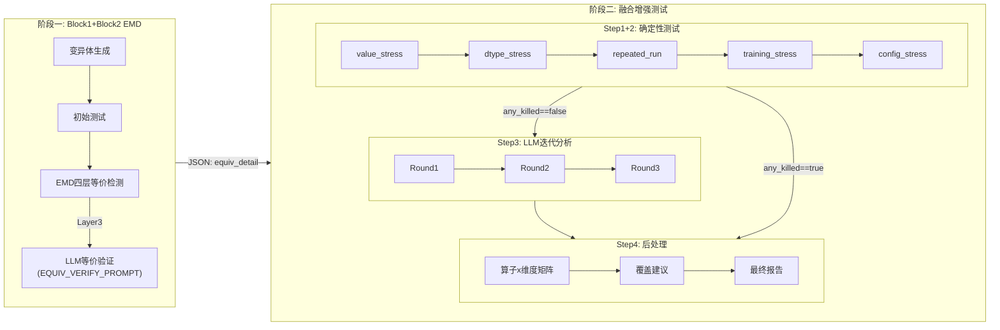
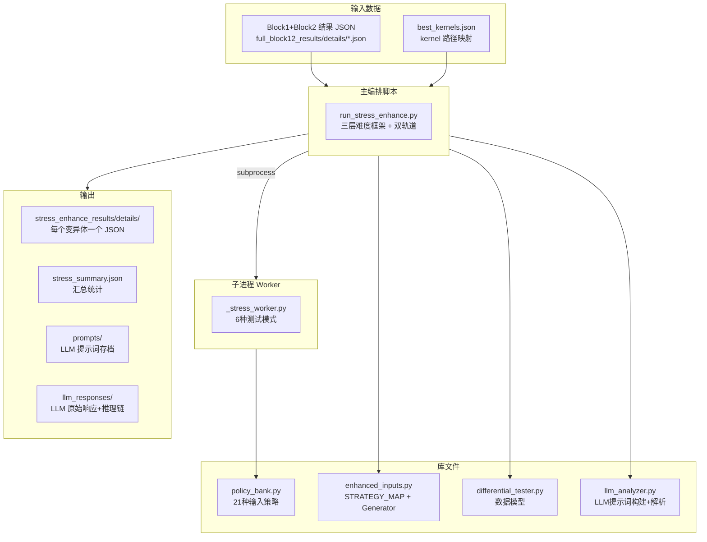

# 两阶段增强测试完整设计与实现文档

> 与代码完全同步，最后更新: 2026-04-21
> 代码版本: `run_stress_enhance.py` + `_stress_worker.py` + `llm_analyzer.py`

---

## 1. 全局流水线总览



---

## 2. 两阶段边界精确定义

### 阶段一: Block1+Block2 (EMD)

| 项目 | 内容 |
|------|------|
| **脚本** | `scripts/full_block12.py` |
| **输入** | 90 个 KernelBench kernel + best_kernels.json |
| **职责** | 变异体生成 → 初始测试 → EMD 四层等价检测 |
| **LLM 调用** | Layer 3 用 `EQUIV_VERIFY_PROMPT` 调 DeepSeek，生成 verdict + suggested_test |
| **输出** | `第二次实验汇总/full_block12_results/details/*.json` |
| **输出数据量** | 1646 个变异体: 939 killed, 270 survived, 264 candidate_eq, 10 strict_eq, 163 stillborn |
| **状态** | **已完成** |

**阶段一结束边界**: 产出 JSON 文件后即结束，不做任何增强测试。

**阶段一产出的关键数据字段** (per mutant equiv_detail):

```
equiv_detail:
├── layer0: cuda_strings_equal, python_host_equal, mutation_domain, cuda_diff_lines
├── layer1: rule_hit, rules_checked, rule_details
├── layer2: is_equivalent, total_rounds, equiv_runs,
│           tested_random_seeds (list), tested_policies (list of {name, status}),
│           first_input_summary, last_input_summary,
│           divergence (如果 Tier 1: {round_type, seed, policy})
├── layer3: verdict, confidence, reasoning, kill_strategy,
│           suggested_test {description, python_code} | null,
│           input_spec, equiv_evidence_sent_to_llm
└── 顶级: input_spec, kernel_name, problem_file
```

---

### 阶段二: 融合增强测试 (Enhanced Testing + LLM Analysis + Post-processing)

| 项目 | 内容 |
|------|------|
| **脚本** | `scripts/run_stress_enhance.py` + `scripts/_stress_worker.py` |
| **输入** | 阶段一的 JSON (survived + candidate_equivalent 变异体) |
| **变异体数量** | 270 survived + 264 candidate_eq = 534 个（Tier 3 过滤后约 ~470 个） |
| **职责** | Step1-2: 确定性测试 → Step3: LLM 迭代分析 → Step4: 后处理 |
| **LLM 调用** | **有**。Step3 对全部维度未杀死的变异体做最多 3 轮迭代式 LLM 分析 (DeepSeek-R1) |
| **输出** | `第二次实验汇总/stress_enhance_results/` 目录 |
| **状态** | **代码已完成，已执行** |

**阶段二结束边界**: 全部变异体的确定性测试 + LLM 迭代分析 + 后处理报告完成后即结束。

---

## 3. 系统架构



---

## 4. 入口与数据加载

### 4.1 加载待测变异体

函数 `load_all_enhanceable()` (`run_stress_enhance.py` L130-L146):

- 扫描 `第二次实验汇总/full_block12_results/details/*.json`
- 筛选 `status` 为 `survived` 或 `candidate_equivalent` 的变异体
- 保留每个变异体的完整 `equiv_detail`（用于 Tier 分类和后续测试决策）
- 返回 `(kernel_name, kernel_meta, mutant_dict)` 元组列表

### 4.2 三层难度分类

函数 `classify_tier()` (L149-L165):

```
if status == "candidate_equivalent" → Tier 3
elif equiv_detail.layer2.is_equivalent == False → Tier 1
elif equiv_detail.layer3.verdict == "possibly_killable" → Tier 2
else → Tier 2 (默认回退)
```

### 4.3 Tier 3 子集筛选

函数 `should_challenge_tier3()` (L168-L179):

- LLM confidence < 0.98 → 挑战
- 算子为以下 6 类之一 → 挑战:
  - B 类: `sync_remove`、`launch_config_mutate`、`mask_boundary`、`index_replace`
  - A 类: `relop_replace`（58 个 Tier 3，最多；边界守卫条件与 mask_boundary 同理）
  - A 类: `const_perturb`（47 个 Tier 3；部分常量影响循环/grid 计算）
- 其余 CANDIDATE_EQ 跳过

### 4.4 执行顺序

```
execution_order = Tier 1 全部 → Tier 2 全部 → Tier 3 (筛选后子集)
```

支持**断点续跑**: `completed.json` 记录已完成的 mutant_id，重启后自动跳过。

### 4.5 变异代码获取

`reconstruct_mutant_code()` (L182-L199): 如果 JSON 中没有 `mutated_code`，则重新调用变异算子重建。当前版本 JSON 已包含 `mutated_code`，此路径仅作回退。

---

## 5. 子进程隔离架构

**所有 CUDA 操作在子进程中执行**，主进程不做任何 GPU 计算。

函数 `_run_stress_worker()` (L206-L248):

1. 创建临时 JSON 配置文件 `stresscfg_*.json`
2. 创建临时结果文件 `stressres_*.json`
3. `subprocess.Popen` 启动 `_stress_worker.py <cfg_path> <res_path>`，设 `start_new_session=True`
4. 超时处理: `proc.communicate(timeout)`，超时则 `os.killpg(SIGKILL)`
5. 读取结果 JSON 返回，清理临时文件

**超时设置**:

| 维度 | 超时 |
|------|------|
| value_stress | 180s |
| dtype_stress | 360s (×2) |
| repeated_run | 540s (×3) |
| training_stress | 180s |
| config_stress | 540s (×3) |
| llm_verify (LLM 建议执行) | 180s |

---

## 6. Worker 的 6 种测试模式

**文件**: `scripts/_stress_worker.py`

### 6.1 `value_stress` — 数值分布压力测试

执行流程:

1. 加载 reference 模型 (`problem_file` 中的 `Model`)
2. 用 `seed` 生成 `template_inputs = get_inputs()`
3. 用指定的 `policy_name` 从 `STRESS_POLICIES` 转换输入数值
4. 三路比较: ref → original → mutant
5. **判杀条件 A**: `original_ok AND NOT mutant_ok` → KILLED (allclose)
6. **判杀条件 B**: `original_ok AND mutant_ok AND NOT bitwise_eq(orig, mut)` → KILLED (bitwise divergence)

**比较方式**:
- allclose: `torch.allclose(a.float().cpu(), b.float().cpu(), atol=1e-2, rtol=1e-2)`
- bitwise: NaN-aware 字节级比较 (`_bitwise_eq`)

### 6.2 `dtype_stress` — 精度切换测试

1. 构建三个模型 (ref/orig/mut)
2. 对每个 target_dtype (`float16`, `bfloat16`): 输入/模型 cast 到目标精度，三路比较
3. **判杀条件**: `orig_ok AND NOT mut_ok` under a specific dtype
4. 优雅处理 "not implemented for 'half'" 类错误

### 6.3 `repeated_run` — 非确定性检测

1. 构建模型，固定一组输入
2. 同一输入执行 mutant **10 次**
3. **判杀条件 A**: 任何一次 trial 中 `mutant != ref` (allclose 或 NaN) → KILLED
4. **判杀条件 B**: mutant 自身输出跨 trial 不一致 (self-inconsistency, atol=1e-6) → KILLED
5. 目标: 检测竞态条件 (如 `sync_remove` 导致的非确定性)

### 6.4 `training_stress` — 训练模式测试

与 `value_stress` 几乎相同，唯一区别:
- 模型用 `.train()` 而非 `.eval()`
- 目的: BatchNorm/LayerNorm 在 eval 模式用固定 running_var，掩盖了 eps/scale 变异。train 模式强制从 batch 统计计算

**仅对以下算子启用** (`TRAINING_TARGET_OPS`):

```python
{"epsilon_modify", "const_perturb", "init_modify", "arith_replace", "cast_remove"}
```

### 6.5 `config_stress` — 配置压力测试 (附加轨道)

1. 构建三个模型 (ref/orig/mut)
2. 遍历 `batch_sizes = [1, 2, 4, 8, 16, 32, 64]` × `seeds = [42, 123, 7777]`
3. 对每个 (batch_size, seed): `get_inputs()` → `_rebatch_inputs()` 截断/repeat 到目标 batch_size → 三路 **bitwise** 比较
4. **判杀条件 A**: mutant 崩溃 → KILLED (mutant_crash)
5. **判杀条件 B**: `NOT bitwise_eq(orig_out, mut_out)` → KILLED (output_divergence)

### 6.6 `llm_verify` — LLM 建议测试执行

1. `exec()` 执行 LLM 生成的 `python_code`，提取 `generate_inputs(device)` 函数
2. 自动修正参数个数
3. 三路 allclose 比较
4. 如果杀死, 额外记录 `diff_summary` (max_diff, mean_diff, range)

---

## 7. EMD Layer 2 与增强测试的去重分析

### 7.1 Layer 2 已完成的测试

EMD Layer 2 对每个存活变异体执行:

- **最多 100 轮随机 seed 测试** (seed 10000~10099): `get_inputs()` + bitwise 比较，eval 模式，fixed-shape
- **最多 6 个算子定向策略 × 2 seeds = 12 轮 stress 测试**: bitwise 比较，eval 模式，fixed-shape

**Tier 区别**:
- **Tier 2/3**: 完整通过全部 112 轮，全部 bitwise 一致
- **Tier 1**: Layer 2 在某轮发现差异后提前退出，后续轮次未执行

因此去重时**必须从 `equiv_detail.layer2.tested_policies` 和 `tested_random_seeds` 动态读取**实际执行过的策略列表。`_get_new_policies()` 实现已正确采用动态读取方式。

### 7.2 每个算子的 Layer 2 已测策略

| 算子 | Layer 2 已测策略（6 个） |
|------|--------------------------|
| `relop_replace` | relop_boundary_hit, boundary_last_element, structured_ramp, near_zero, sparse, large_magnitude |
| `arith_replace` | extreme_magnitude, large_magnitude, near_zero, all_negative, sparse, boundary_last_element |
| `mask_boundary` | boundary_last_element, structured_ramp, head_heavy, tail_heavy, sparse, large_magnitude |
| `index_replace` | head_heavy, tail_heavy, structured_ramp, large_magnitude, sparse, boundary_last_element |
| `sync_remove` | structured_ramp, head_heavy, tail_heavy, large_magnitude, sparse, boundary_last_element |
| `const_perturb` | near_zero, boundary_last_element, sparse, large_magnitude, structured_ramp, all_negative |
| `epsilon_modify` | near_epsilon, near_zero, denormals, large_magnitude, sparse, boundary_last_element |
| `launch_config_mutate` | structured_ramp, head_heavy, tail_heavy, large_magnitude, sparse, boundary_last_element |
| 其他 | large_magnitude, near_zero, structured_ramp, all_negative, sparse, boundary_last_element |

### 7.3 增强测试真正的增量维度

以下是 Layer 2 **完全没做过**的测试维度:

| 增量维度 | 内容 | 价值 |
|----------|------|------|
| Layer 2 未使用的 ~15 个策略 | near_overflow, denormals, all_positive, mixed_extremes, alternating_sign, uniform_constant, init_sensitive, reduction_adversarial, dense_nonzero, sparse_extreme 等 | 全新数值分布 |
| dtype_stress | float16/bfloat16 精度切换 | 全新精度环境 |
| repeated_run | 同一输入跑 10 次 | 检测非确定性 |
| training_stress | 模型 .train() 模式 | 全新执行模式 |
| config_stress | 变 batch_size | 全新并行配置 |
| llm_iterative_analysis | LLM 迭代分析 (最多 3 轮) | 语义定向 |

---

## 8. 去重后的增强测试策略

### 8.1 设计原则：统一覆盖，Tier 只影响优先级和额外步骤

- **去重**: 所有 Tier 统一去掉与 Layer 2 重复的策略
- **双轨道结构**:
  - **主轨道 (Main Track)**: 严格 fixed-shape，只改值。包含 value_stress、dtype_stress、repeated_run、training_stress
  - **附加轨道 (Config-Stress Track)**: 允许变 batch 配置。包含 config_stress，结论在论文中单独报告
- **覆盖统一**: 所有 Tier 都跑主轨道全部维度 + 附加轨道
- **Tier 差异仅体现在**: 执行优先级顺序、Tier 特有额外步骤 (replay)、value_stress 的 seeds 强度
- **跨维度不做早停**: 即使某个维度已杀死，后续维度仍然执行。维度内部保留早停

### 8.2 所有 Tier 统一执行的基础测试

```
Base-1: 新策略 value_stress（去重后）
  ├─ 从 21 个策略中排除 Layer 2 已用的 6 个 → 剩余 ~15 个新策略
  ├─ Tier 1/2: 15 策略 × 3 seeds = 45 轮
  ├─ Tier 3:   15 策略 × 5 seeds = 75 轮
  └─ 只使用 Layer 2 未覆盖的数值分布

Base-2: dtype_stress
  ├─ 3 seeds × 2 dtype (float16, bfloat16) = 6 轮
  └─ 全新精度环境

Base-3: repeated_run
  ├─ 3 seeds × 10 trials = 30 轮
  └─ 检测非确定性

Base-4: training_stress（仅对适用算子，不去重）
  ├─ 全部 21 策略 × 3 seeds = 最多 63 轮
  │   （STRATEGY_MAP 中策略排在最前面优先执行）
  │   不排除 Layer 2 已用策略——.train() vs .eval() 是不同执行模式
  └─ 适用算子: epsilon_modify, const_perturb, init_modify, arith_replace, cast_remove

--- 以下为附加轨道 ---

Base-5: Config-Stress Track
  ├─ 7 batch_sizes × 3 seeds = 21 组合
  └─ 结论单独报告，不纳入主轨 fixed-shape 结果
```

**统一基础预算**:

| 场景 | 主轨道 | 附加轨道 | 合计 |
|------|--------|----------|------|
| 适用 training_stress | 144~174 轮 | 21 轮 | 165~195 轮 |
| 不适用 training_stress | 81~111 轮 | 21 轮 | 102~132 轮 |
| 加权平均 (~30% 适用) | — | — | ~120~150 轮/变异体 |

### 8.3 Tier 特有的额外步骤

| Tier 特有步骤 | Tier 1 | Tier 2 | Tier 3 | 理由 |
|-------------|:------:|:------:|:------:|------|
| **复放 L2 divergence** | 有 | — | — | Tier 1 有 `layer2.divergence` 记录 |
| **LLM 迭代分析** | 有 | 有 | 有 | `any_killed == false` 时触发 |
| **统计置信度报告** | — | — | 有 | Tier 3 为 CANDIDATE_EQ |
| **value_stress 强度** | 3 seeds | 3 seeds | 5 seeds | Tier 3 加量增加统计置信度 |

### 8.4 各 Tier 执行优先级顺序（代码实际实现）

**Tier 1** (已知 bitwise 差异，需放大到 allclose 失败):
```
主轨道: replay → value_stress → dtype_stress → training_stress → repeated_run
附加轨道: config_stress
```

**Tier 2** (112 轮 bitwise 一致，需新维度突破):
```
主轨道: dtype_stress → training_stress → value_stress → repeated_run
附加轨道: config_stress
```

**Tier 3** (高度疑似等价，最高强度挑战):
```
主轨道: dtype_stress → value_stress(5seeds) → repeated_run → training_stress
附加轨道: config_stress
```

### 8.5 早停策略

**跨维度不早停**: 即使 value_stress 已杀死，其他维度仍继续。
- 覆盖建议需要完整画像
- 支持算子 × 维度交叉分析

**维度内部保留早停**: 同维度内杀死即跳过剩余轮次。
- 同类证据无增量价值
- 成本控制

### 8.6 策略去重实现

`_get_new_policies()` (L276-L290):

```python
def _get_new_policies(operator_name, all_policies, mutant_meta):
    ed = mutant_meta.get("equiv_detail", {})
    l2 = ed.get("layer2", {})
    tested = set()
    for p in l2.get("tested_policies", []):
        if isinstance(p, dict):
            tested.add(p.get("name", ""))
        elif isinstance(p, str):
            tested.add(p)
    mapped = STRATEGY_MAP.get(operator_name, [])
    mapped_new = [p for p in mapped if p not in tested]
    remaining = [p for p in all_policies if p not in tested and p not in mapped]
    return mapped_new + remaining
```

动态从 `tested_policies` 读取已测策略列表，确保 Tier 1 (early-exit) 场景也能正确去重。STRATEGY_MAP 中的策略排在最前面优先执行。

---

## 9. 输入策略库 (policy_bank.py)

**21 种策略**, 全部保持 shape/dtype 不变:

| 策略名 | 数值特征 | 目标场景 |
|--------|----------|----------|
| `large_magnitude` | randn × 1000 | 算术溢出 |
| `near_overflow` | randn × dtype上界 | 精度极限 |
| `near_zero` | randn × 1e-7 | epsilon 路径 |
| `denormals` | randn × 1e-38 | 非正规数 |
| `all_negative` | -\|randn\| × 100 | 全负值 |
| `all_positive` | \|randn\| × 100 | 全正值 |
| `mixed_extremes` | 50%×10000 + 50%×0.0001 | 极端混合 |
| `alternating_sign` | 交替 +/- × 100 | reduction 误差 |
| `sparse` | 90% 零 + 10% randn×100 | 稀疏激活 |
| `uniform_constant` | 全 88.0 | 常量折叠 |
| `structured_ramp` | [0, 1/n, 2/n, ...] | 索引/位置可观测 |
| `boundary_last_element` | randn + 末位=1e4 | 边界 off-by-one |
| `head_heavy` | 前25%极端+其余近零 | 索引头部偏移 |
| `tail_heavy` | 后25%极端+其余近零 | 索引尾部偏移 |
| `relop_boundary_hit` | arange % 10 (整数值) | 关系运算边界 |
| `extreme_magnitude` | randn × 1e6 | 大幅度溢出 |
| `near_epsilon` | [1e-7, 1e-5] 均匀 | epsilon 分支 |
| `reduction_adversarial` | 交替 +1e4/-1e4 | FP 归约误差 |
| `init_sensitive` | 随机全正或全负 | min/max init |
| `dense_nonzero` | \|randn\| + 1.0 | 消除零值掩盖差异 |
| `sparse_extreme` | 99% 零 + 1% ×1e4 | 极端稀疏边界 |

### 稀疏性三档梯度

| 策略 | 零值比例 | 非零元素特征 | 主要目标 |
|------|---------|-------------|---------|
| `dense_nonzero` | 0% | \|randn\|+1.0 | 算术差异最大化 (arith_replace, epsilon_modify) |
| `sparse` | ~90% | randn×100 | 常规稀疏 |
| `sparse_extreme` | ~99% | randn×1e4 | 极端稀疏边界 (mask_boundary, relop_replace) |

### 算子 → 策略优先映射 (STRATEGY_MAP)

定义在 `enhanced_inputs.py`，用于 value_stress 和 training_stress 的策略排序:

```python
STRATEGY_MAP = {
    "epsilon_modify":    ["near_zero", "denormals", "dense_nonzero"],
    "scale_modify":      ["uniform_constant", "structured_ramp"],
    "stab_remove":       ["large_magnitude", "near_overflow"],
    "cast_remove":       ["near_overflow", "large_magnitude"],
    "init_modify":       ["all_negative", "sparse"],
    "acc_downgrade":     ["mixed_extremes", "large_magnitude"],
    "reduction_reorder": ["mixed_extremes", "alternating_sign"],
    "broadcast_unsafe":  ["structured_ramp"],
    "layout_assume":     ["structured_ramp"],
    "index_replace":     ["structured_ramp", "large_magnitude", "head_heavy", "tail_heavy"],
    "mask_boundary":     ["boundary_last_element", "sparse", "sparse_extreme"],
    "sync_remove":       ["large_magnitude", "mixed_extremes"],
    "launch_config_mutate": ["structured_ramp", "large_magnitude"],
    "arith_replace":     ["large_magnitude", "mixed_extremes", "dense_nonzero"],
    "relop_replace":     ["boundary_last_element", "structured_ramp", "sparse_extreme"],
    "const_perturb":     ["near_zero", "large_magnitude"],
}
```

---

## 10. LLM 迭代分析 (Step 3)

### 10.1 触发条件

`any_killed == false` — Step 1+2 的全部维度 (含 config_stress) 都未杀死。任一维度杀死即跳过 LLM。

### 10.2 设计依据

原 `llm_suggested_test` 维度仅执行阶段一 Layer 3 已存储的代码，但 534 个变异体中仅 103 个 (19.3%) 有代码，80.7% 为空。融合后 LLM 拿到 Step 1+2 完整确定性测试结果作为上下文，信息量远超阶段一。

### 10.3 LLM 配置

| 参数 | 值 |
|------|------|
| 模型 | `deepseek-reasoner` (DeepSeek-R1) |
| max_tokens | 8192 |
| temperature | 不设置 (R1 模型不支持) |
| API base | `https://api.deepseek.com` |

### 10.4 迭代流程 (最多 3 轮)

```
Round 1: ANALYSIS_PROMPT_V2
  输入:
  ├── 完整源码 (原始 + 变异)
  ├── EMD 等价检测证据 (L0-L3)
  │   ├── Layer 0: CUDA/host 差异、mutation_domain
  │   ├── Layer 1: 静态规则命中/未命中
  │   ├── Layer 2: 已测 policy 列表 + 种子数 + 输入摘要
  │   └── Layer 3: verdict + reasoning + kill_strategy
  ├── Step 1+2 确定性测试完整结果:
  │   ├── value_stress: 15~21 策略 × 3~5 seeds 全部 bitwise 一致
  │   ├── dtype_stress: float16/bfloat16 结果
  │   ├── repeated_run: 10 次重复结果
  │   ├── training_stress: .train() 模式结果或跳过原因
  │   └── config_stress: 7 batch_sizes × 3 seeds 结果
  └── 固定输入规格 (input_spec)

  LLM 返回: survival_reason + killable + kill_strategy + suggested_test
           + reason_category + proof_sketch

Round 2 (如果 Round 1 未杀死): REANALYSIS_PROMPT_V2
  额外输入: Round 1 的 suggested_test 执行结果 + 失败原因
  LLM 基于失败反馈生成改进版 suggested_test

Round 3 (如果 Round 2 未杀死): REANALYSIS_PROMPT_V2
  额外输入: Round 1 + Round 2 的失败历史
```

### 10.5 每轮验证

复用 `_stress_worker.py` 的 `llm_verify` 模式，GPU 子进程三路比较。

### 10.6 Fixed-shape 过滤

LLM 的 `kill_strategy` 经过 13 个 shape 变更关键词检查 (`_llm_suggestion_violates_fixed_shape`)，违反者不执行代码。

### 10.7 阶段一 Layer 3 suggested_test 的处理

- 不再作为独立维度执行
- 其内容通过 `{equiv_evidence}` 的 Layer 3 部分传入 LLM（作为"上次判断"的上下文）
- LLM 在 Step 3 中为每个存活变异体重新生成建议

### 10.8 LLM 响应记录

`_setup_llm_caller()` 返回结构:

```python
{
    "content": str,            # LLM 最终回答 (JSON)
    "reasoning_content": str,  # R1 推理链
    "model": str,              # 实际使用的模型
    "usage": {                 # token 统计
        "prompt_tokens": int,
        "completion_tokens": int,
        "total_tokens": int,
        "reasoning_tokens": int,  # R1 特有
    }
}
```

每轮响应保存到 `llm_responses/{mutant_id}_r{N}_response.json`，包含 `reasoning_content`。

---

## 11. 结果存储

### 11.1 每个变异体的详情 JSON

路径: `stress_enhance_results/details/{mutant_id}.json`

字段按时间顺序排列: 基本信息 → Phase 1 EMD → Phase 2 确定性测试 → Phase 2 LLM 分析 → 最终结论。

```json
{
  // 1. 基本信息
  "mutant_id": "L1_P1__relop_replace__2",
  "operator_name": "relop_replace",
  "operator_category": "A",
  "kernel_name": "L1_P1",
  "tier": 1,
  "original_status": "survived",
  "site_node_type": "cuda_Lt",

  // 2. Phase 1: 等价变异体检测 (EMD Layer 0-3)
  "equiv_detail": { "layer0": {}, "layer1": {}, "layer2": {}, "layer3": {} },

  // 3. Phase 2: 确定性增强测试
  "main_track": {
    "tier1_replay": {
      "executed": true,
      "killed": false,
      "detail": { "seed": 10042, "policy": "structured_ramp" }
    },
    "value_stress": {
      "executed": true,
      "killed": false,
      "killing_policy": null,
      "killing_seed": null,
      "kill_type": null,
      "rounds_executed": 45,
      "rounds_total": 45,
      "policy_results": [],
      "original_failures": [],
      "aborted_reason": null
    },
    "dtype_stress": {
      "executed": true,
      "killed": false,
      "killing_dtype": null,
      "killing_seed": null,
      "results": []
    },
    "repeated_run": {
      "executed": true,
      "killed": false,
      "inconsistency_detected": false,
      "divergent_trial": null,
      "killing_seed": null,
      "results": []
    },
    "training_stress": {
      "executed": true,
      "killed": false,
      "skipped_reason": null,
      "killing_policy": null,
      "killing_seed": null,
      "rounds_executed": 63,
      "rounds_total": 63,
      "results": [],
      "original_failures": [],
      "aborted_reason": null
    }
  },
  "config_track": {
    "config_stress": {
      "executed": true,
      "killed": false,
      "killing_batch_size": null,
      "kill_type": null,
      "results_per_batch": {}
    }
  },
  "original_failures": [],

  // 4. Phase 2: LLM 迭代分析
  "llm_iterative_analysis": {
    "executed": true,
    "trigger": "all_dimensions_survived",
    "rounds": [
      {
        "round": 1,
        "prompt_type": "ANALYSIS_PROMPT_V2",
        "model": "deepseek-reasoner",
        "usage": { "prompt_tokens": 5000, "completion_tokens": 2000 },
        "reason_category": "boundary_unreachable",
        "proof_sketch": "...",
        "survival_reason": "...",
        "killable": true,
        "kill_strategy": "...",
        "recommendations": "...",
        "suggested_code": "def generate_inputs(device): ...",
        "execution_result": {
          "killed": false,
          "ref_ok": true, "original_ok": true, "mutant_ok": true,
          "diff_summary": "", "error": ""
        },
        "killed": false
      }
    ],
    "killed": false,
    "killing_round": 0,
    "robustness_suggestion": "..."
  },

  // 5. 最终结论
  "kill_summary": {
    "deterministic_killed": false,
    "llm_killed": false,
    "main_track_killed_by": [],
    "config_track_killed_by": [],
    "llm_killing_round": 0,
    "total_dimensions_executed": 6,
    "total_dimensions_killed": 0,
    "final_killed": false
  },
  "any_killed": false,
  "first_kill_mode": null,
  "total_time_ms": 12345.6,

  // Tier 3 特有
  "tier3_confidence": {
    "total_passed_rounds": 132,
    "confidence_equivalent_lower_bound": 0.9925,
    "interpretation": "..."
  }
}
```

### 11.2 汇总 JSON

路径: `stress_enhance_results/stress_summary.json`

```json
{
  "total_tested": 499,
  "killed_count": 150,
  "survived_count": 349,
  "kill_rate": 0.3006,
  "deterministic_kill_count": 130,
  "llm_kill_count": 20,
  "llm_rounds_distribution": { "1": 12, "2": 5, "3": 3 },
  "per_dimension_kills": {
    "tier1_replay": 10,
    "value_stress": 50,
    "dtype_stress": 15,
    "repeated_run": 5,
    "training_stress": 20,
    "config_stress": 30,
    "llm_iterative_analysis": 20
  },
  "per_policy_kills": { "large_magnitude": 8, "near_zero": 5 },
  "multi_dimension_kill_count": 25,
  "tier_tested": { "1": 151, "2": 119, "3": 229 },
  "tier_kills": { "1": 80, "2": 40, "3": 30 }
}
```

### 11.3 文件结构

```
第二次实验汇总/
├── full_block12_results/           ← 阶段一输出 (已有)
│   ├── details/*.json
│   └── summary.md
├── stress_enhance_results/         ← 阶段二输出
│   ├── details/                    ← 每个变异体的完整 JSON
│   ├── prompts/                    ← LLM 调用的完整提示词
│   ├── llm_responses/              ← LLM 原始响应+推理链
│   ├── completed.json              ← 断点续跑
│   └── stress_summary.json         ← 汇总统计
└── docs/
    ├── EquivalentDetection_V2_Plan.md
    └── StressEnhance_Plan.md       ← 本文件
```

---

## 12. 安全机制

1. **GPU 健康检查** (`gpu_health_check()`): 每个变异体测试完后检查 CUDA 响应，失败等 10s 重试，仍失败则 abort
2. **GPU 清理** (`gpu_cleanup()`): 清除 stale 模块、`torch.cuda.empty_cache()`
3. **连续超时中断**: value_stress / training_stress 维度中连续 5 次子进程超时 (`MAX_CONSECUTIVE_TIMEOUTS=5`)，跳过该维度的剩余轮次（不跳过整个变异体）
4. **断点续跑**: `completed.json` 记录已完成 ID，重启自动续接
5. **LLM 建议过滤** (`_llm_suggestion_violates_fixed_shape`): 包含 13 个 shape 变更关键词的 kill_strategy 被主轨道拒绝

---

## 13. Tier 3 特殊关注算子分析

### 13.1 确定加入: `relop_replace`

- **Tier 3 数量: 58 个** — 所有算子中最多
- **原因**: 边界守卫条件与 `mask_boundary` 同理，batch_size 变化可改变边界可达性

### 13.2 确定加入: `const_perturb`

- **Tier 3 数量: 47 个** — 第二多
- **原因**: 部分常量涉及循环上界或 shared memory 大小，改变 batch 后迭代次数可能变化

### 13.3 `cast_remove` 的特殊问题

- **Tier 3 数量: 10 个**
- `cast_remove` 等价性取决于精度而非并行配置，`dtype_stress` 是最有效的测试
- 统一覆盖方案下所有 Tier 3 已自动执行 `dtype_stress`，此缺口已消除

### 13.4 不需要特殊关注的算子

| 算子 | Tier 3 数量 | 不需要的理由 |
|------|------------|-------------|
| `arith_replace` | 27 | 等价性取决于数值，与并行配置无关 |
| `epsilon_modify` | 2 | 数量极少 |
| `init_modify` | 3 | `-inf→-1e10` 只要数据在范围内就等价 |
| `broadcast_unsafe` | 2 | 理论上 batch 敏感，但样本太少 |

---

## 14. 数据模型 (differential_tester.py)

### StressTestResult

每个变异体的增强测试结果，采用 per-dimension 结构:

- `main_track: Dict[str, Dict]` — 主轨道各维度结果
- `config_track: Dict[str, Dict]` — 附加轨道各维度结果
- `llm_analysis: Dict` — LLM 迭代分析结果
- `_kill_order: List[str]` — 杀死顺序记录

关键属性:
- `deterministic_killed`: Step 1+2 是否杀死
- `llm_killed`: Step 3 是否杀死
- `any_killed`: 任一方式杀死
- `first_kill_mode`: 第一个杀死的维度名

### StressSummary

汇总统计:
- `per_dimension_kills`: 各维度杀死计数
- `per_policy_kills`: 各策略杀死计数
- `multi_dimension_kill_count`: 被多维度同时杀死的变异体数
- `llm_rounds_distribution`: LLM 在第 N 轮杀死的分布

---

## 15. Step 4: 后处理 (全部变异体完成后统一执行)

### 模块 A: 算子 × 维度交叉分析

构建 16 算子 × 6 维度的 kill 计数矩阵:

```
               value  dtype  repeated  training  config  llm_analysis
arith_replace    12     3       0         5        1         2
relop_replace     3     0       0         0        7         1
epsilon_modify    8     2       0        11        0         0
...
```

### 模块 B: 覆盖建议生成 (规则驱动)

- `value_stress` 杀死 → "补充 {killing_policy} 类数值分布测试"
- `dtype_stress` 杀死 → "增加低精度 (float16/bfloat16) 验证"
- `config_stress` 杀死 → "测试非默认 batch_size 配置"
- `training_stress` 杀死 → ".train() 模式下的 BN/LN 行为需要验证"
- `llm_analysis` 杀死 → 引用 LLM 的 kill_strategy
- 全部未杀死 → 引用 LLM 的 survival_reason

### 模块 C: 存活原因聚类

全部存活变异体的 survival_reason 送入 LLM 做分类学聚类。

### 模块 D: 最终统计报告

- mutation score
- 等价变异体最终确认 (Tier 3 全部步骤后仍未杀死 → confirmed_equivalent)
- kill rate by tier / by operator / by dimension
- LLM 迭代 kill rate (Round 1/2/3)
- 多维度敏感性分布

---

## 研究背景与动机

### 为什么需要增强测试模块？目前的难题与研究现状

#### 核心问题：survived mutant 的处置困境

变异测试的核心产出是 survived mutant（未被测试套件杀死的变异体），它们可能是：(1) **等价变异体**——语义等价于原程序，不可能被任何测试杀死；(2) **stubborn mutant**（顽固变异体）——非等价但现有测试不够强，未触发其差异行为。区分两者是变异测试领域的根本难题。

Du et al. (ISSTA 2023) 的实证研究 "To Kill a Mutant" 揭示了变异体杀死机制的多样性：一个变异体可能因断言失败、程序崩溃或输出偏差等不同原因被杀死，且 crash 对变异体杀死的贡献远超预期。这意味着**单一维度的测试策略难以覆盖所有杀死路径** [Du et al., "To Kill a Mutant: An Empirical Study of Mutation Testing Kills," *ISSTA*, 2023]。

#### 传统变异测试对 survived mutant 的处理方式

现有工具（如 PIT for Java, Stryker for JavaScript, mutmut for Python）在检测到 survived mutant 后，通常只报告"测试不足"的诊断信息，将修复工作完全留给开发者。Google 在工业实践中将变异测试集成到 code review 流程，但也只是标记 survived mutant 供人工审查 [Petrovic et al., "Does Mutation Testing Improve Testing Practices?", *ICSE*, 2021]。

**没有现有工具自动化地针对 survived mutant 生成多维度测试策略并执行验证。**

#### GPU/CUDA kernel 的测试复杂性

GPU kernel 的测试远比传统顺序程序复杂：

1. **数值敏感性**：GPU 浮点运算受精度（FP16/BF16/FP32/FP64）、运算顺序、编译器优化（如 `-ffast-math`）等多重因素影响。Laguna et al. (SC Workshop 2024) 使用 Varity 随机程序生成器发现 NVIDIA 和 AMD GPU 之间存在大量编译器引入的数值差异 [Laguna et al., "Testing GPU Numerics: Finding Numerical Differences Between NVIDIA and AMD GPUs," *SC Workshop*, 2024]。

2. **执行模式差异**：GPU kernel 在 inference 模式（`.eval()`）和 training 模式（`.train()`）下的行为可能不同，BatchNorm、LayerNorm 等层在两种模式下使用不同的统计量。

3. **配置敏感性**：kernel 的正确性可能依赖于 batch size、tensor shape 等配置参数。KernelBench benchmark 固定了输入 shape，但变异可能引入仅在非标准配置下暴露的 bug [Ouyang et al., "KernelBench: Can LLMs Write GPU Kernels?", *NeurIPS*, 2024]。

4. **并发非确定性**：`__syncthreads()` 移除等变异可能引入 data race，表现为非确定性错误——单次执行可能通过，多次执行才能暴露。

5. **参考实现边界行为**：PyTorch 参考模型在极端输入下可能产生 NaN/Inf，使差分比较失效。

#### LLM 辅助测试生成的兴起

近年来，LLM 在测试生成领域展现了显著潜力：

- **Meta 的 ACH**（FSE 2025 Industry）：mutation-guided LLM-based test generation，用 survived mutant 作为 LLM 的输入来生成针对性测试，目标是"杀死"未被现有测试检测到的故障 [Meta, "Mutation-Guided LLM-based Test Generation at Meta," *FSE Industry*, 2025]。
- **PRIMG**（EASE 2025）：通过 mutant prioritization 和增量自适应测试生成框架，指导 LLM 聚焦于最"有用"的 survived mutant，避免生成冗余测试 [PRIMG, "Efficient LLM-driven Test Generation Using Mutant Prioritization," *EASE*, 2025]。
- **STING**（arXiv 2025）：mutation-guided test strengthening，利用 survived variant 驱动针对性测试合成来加固 benchmark 测试套件 [STING, "Are Benchmark Tests Strong Enough? Mutation-Guided Test Strengthening," *arXiv:2604.01518*, 2025]。

但这些工作全部针对**传统软件**（Java、Solidity 等），**没有任何工作将 LLM 辅助的 mutation-guided 测试生成应用于 GPU CUDA kernel 源码级变异体**。

#### 差分测试在 DL 系统中的应用

差分测试（Differential Testing）在深度学习系统测试中有广泛应用：

- **D³** (TSE/ICSE 2025)：利用分布式等价规则对分布式深度学习软件进行差分测试，发现了 PyTorch 和 TensorFlow 中的 21 个 bug [D³, "Differential Testing of Distributed Deep Learning," *TSE/ICSE*, 2025]。
- **CRADLE**：跨后端差分验证，比较不同 DL 框架实现的输出来检测和定位 bug。
- **CuFuzz** (FSE 2026)：基于 API 知识图和 LLM 的 CUDA 库模糊测试框架，发现了 4 个未知 bug 和 2 个 CVE [CuFuzz, "CuFuzz: An API-Knowledge-Graph Coverage-Driven Fuzzing Framework for CUDA Libraries," *FSE*, 2026]。

但这些差分测试方法关注的是**框架级 bug 检测**，而非**源码级变异体的针对性杀伤**。

### MutaKernel 增强测试模块解决了什么问题？

#### 首个面向 CUDA kernel 变异体的多维度增强测试系统

MutaKernel 的增强测试模块是（据我们所知）**首个专门针对 GPU CUDA kernel 源码级 survived mutant 的多维度自动化增强测试系统**。它填补了从"检测到 survived mutant"到"系统化尝试杀死它或确认其等价性"之间的空白。

#### 解决的关键问题

**1. 多维度杀伤策略（5 deterministic + 1 LLM iterative）**

传统的"增加随机测试"方式对 GPU kernel 效果有限。我们设计了 6 个互补的测试维度，覆盖不同的杀伤路径：

| 维度 | 杀伤目标 | 对应的 GPU 特有问题 |
|------|---------|-------------------|
| **value_stress** | 数值边界、极端分布 | 浮点精度、overflow/underflow |
| **dtype_stress** | 低精度类型 (FP16/BF16) | 精度退化、类型转换 bug |
| **training_stress** | .train() 模式行为 | BN/LN 运行统计 vs 训练统计 |
| **repeated_run** | 非确定性 data race | sync_remove 引入的竞态 |
| **config_stress** | 非标准 batch size | grid/block 计算边界 |
| **LLM iterative** | 上述全部失败后的智能分析 | 综合源码语义理解 |

这种多维度设计受 Du et al. (ISSTA 2023) 的启发——单一维度无法覆盖所有杀死机制。

**2. 算子定向输入生成（Operator-Directed Stress Policies）**

受 state infection condition [Offutt & Lee, TSE 1996] 启发，我们为 16 类 CUDA 变异算子设计了 21 种定向 stress policy（如 `denormals`、`near_overflow`、`reduction_adversarial`、`sparse_extreme`），通过 `STRATEGY_MAP` 将每类算子映射到最可能触发其差异行为的输入模式。这比"一刀切"的随机输入更高效。

**3. No Cross-Dimension Early Stop 设计**

传统变异测试在杀死变异体后立即停止。我们有意地**不做跨维度早停**——即使 `value_stress` 已经杀死了变异体，仍继续运行 `dtype_stress`、`training_stress` 等维度。这样做的目的是：
- 获得完整的多维度敏感性分布（论文贡献之一）
- 发现哪些维度对哪类算子最有效
- 为测试策略推荐提供数据支撑

**4. Dual-Track 测试架构**

区分 Main Track（fixed-shape，变值）和 Config-Stress Track（变 batch size），确保：
- 主实验在严格的 fixed-shape 契约下进行，结果可复现
- 辅助 track 探索配置变化的影响，但不混淆主实验结论

**5. LLM 迭代修复机制**

当所有 deterministic 维度都失败后，触发 LLM（DeepSeek-R1）进行最多 3 轮迭代分析：
- Round 1：分析完整源码 + EMD 证据 + deterministic 测试结果，给出 kill strategy 或 unkillable 判定
- Round 2-3：分析前轮失败原因，修复策略后重试

这与 Meta ACH (FSE 2025) 的 mutation-guided LLM test generation 思路一致，但我们是在 **CUDA kernel** 领域首次实现，且将 LLM 与 4 层 EMD 证据链和 5 维 deterministic 测试结果深度整合。

#### 为什么不可或缺？

1. **等价变异体的最终确认**：只有经过完整增强测试仍然 survived 的变异体，才能被高置信度地判定为等价变异体。EMD 的 Layer 0-3 提供初步判定，增强测试提供最终验证。

2. **Mutation Score 的精确化**：增强测试能杀死 EMD 认为可能等价但实际可杀的变异体（如 Tier 2 的 5 个被杀），提高 mutation score 的精确性。

3. **测试策略推荐的数据基础**：多维度测试结果直接转化为可操作的覆盖建议（如"该 kernel 需要增加低精度测试"），这是论文的实用贡献之一。

4. **GPU 变异测试的完整闭环**：从变异生成 → 初始测试 → 等价检测 → **增强测试** → 最终判定，增强测试是实现闭环的关键一环。

### 有效性威胁与未来工作

#### 当前有效性威胁

**1. LLM 迭代分析的杀伤效果 (Construct Validity)**

在当前实验中，LLM 迭代分析执行了 69 次，杀死 0 个变异体。所有 LLM 未杀死的 survived mutant 都被 LLM 判定为 `killable=false`（给出 reason_category 和 proof_sketch）。这引发两个问题：
- LLM 生成的 kill strategy 在执行时是否因为框架限制（如 `ref NaN/Inf`、worker 超时）而未能体现真实效果？
- LLM 是否在 Round 1 过早放弃（判定 unkillable），而更激进的 prompt 策略可能引导它找到有效的 kill input？

**2. 参考实现的边界行为 (Internal Validity)**

差分测试依赖参考实现（PyTorch reference）的正确性。当参考实现在极端输入下产生 NaN/Inf 时，我们的 `ref_nan_fallback` 机制会退而使用原始 kernel 的输出作为比较目标。这引入了一个假设："原始 kernel 在该输入下的输出是正确的"——但原始 kernel 本身也可能有 bug。

**3. Fixed-shape 契约的局限性 (External Validity)**

所有测试在 KernelBench 固定的 input shape 下进行。某些变异可能仅在特定 shape 下可杀（如 grid size 恰好整除的情况）。config_stress 的 batch size 变化仅是有限的探索，不能覆盖所有可能的 shape 组合。

**4. Stress Policy 的覆盖完整性 (Construct Validity)**

21 种 stress policy 虽然覆盖了常见的数值边界模式，但可能遗漏了 GPU 特有的 adversarial pattern（如利用 warp shuffle 语义的输入、触发 shared memory bank conflict 的特定访问模式）。

**5. 非确定性测试的统计置信度 (Construct Validity)**

`repeated_run` 使用 3 次重复来检测非确定性行为（data race）。由于 GPU 调度的非确定性，3 次可能不足以暴露低概率的 race condition。增加重复次数会提高置信度但也增加时间成本。

**6. Worker 超时导致的信息缺失 (Internal Validity)**

CUDA JIT 编译（`load_inline`）对某些复杂 kernel 可能需要数分钟。当 stress worker 超时时，该维度的测试结果为空（runs=0），导致无法判断变异体在该维度下的行为。这在 Tier 2 的部分变异体中已观察到。

#### 未来工作

**1. LLM Kill 策略的增强**

- **多模型 ensemble**：使用多个 LLM（如 GPT-5.4、Claude Opus 4.6、DeepSeek-R1）分别生成 kill strategy，投票或取并集
- **Code-level 反馈**：将 LLM 生成代码的编译错误、运行时异常信息反馈给 LLM，进行更精细的修复迭代
- **Symbolic execution 辅助**：对 LLM 认为可杀但动态测试未能验证的变异体，尝试轻量级符号执行生成反例输入

**2. 自适应 Stress Policy 生成**

基于已有实验数据（哪类 policy 对哪类算子最有效），训练一个轻量级的 policy 选择器或 policy 生成器，动态为新的 survived mutant 生成定向 stress policy，而非使用固定的 `STRATEGY_MAP`。

**3. 配置空间的系统化探索**

将 config_stress 从当前的 7 种 batch size 扩展为对 input shape 各维度的系统化探索（如 `dim ± 1`、`dim = blockDim`、素数维度），识别 configuration-dependent equivalence。

**4. GPU 架构感知的测试**

当前测试在单一 GPU 架构上执行。未来可引入跨架构差分测试（如 A100 vs H100 vs RTX 4090），利用不同 GPU 的 warp scheduling 差异来暴露 data race 和 warp divergence 相关的变异。

**5. 增强测试结果到测试套件的自动转化**

将增强测试中成功杀死变异体的 policy + seed 组合自动转化为回归测试用例，集成到 CI/CD 管线中。实现从"变异测试诊断"到"测试套件加固"的闭环。

---

## 参考文献

| # | 引用 | 出处 |
|---|------|------|
| 1 | Du, H. et al. "To Kill a Mutant: An Empirical Study of Mutation Testing Kills" | *ACM ISSTA*, 2023 |
| 2 | Petrovic, G., Ivankovic, M. & Just, R. "Does Mutation Testing Improve Testing Practices?" | *IEEE ICSE*, 2021 |
| 3 | Offutt, A.J. & Lee, S.D. "An Empirical Evaluation of Weak Mutation" | *IEEE TSE*, 22(5), 1996 |
| 4 | Laguna, I. et al. "Testing GPU Numerics: Finding Numerical Differences Between NVIDIA and AMD GPUs" | *SC Workshop*, 2024 |
| 5 | Ouyang, S. et al. "KernelBench: Can LLMs Write GPU Kernels?" | *NeurIPS*, 2024 |
| 6 | Meta. "Mutation-Guided LLM-based Test Generation at Meta" (ACH) | *ACM FSE Industry*, 2025 |
| 7 | PRIMG. "Efficient LLM-driven Test Generation Using Mutant Prioritization" | *EASE*, 2025 |
| 8 | STING. "Are Benchmark Tests Strong Enough? Mutation-Guided Test Strengthening" | *arXiv:2604.01518*, 2025 |
| 9 | D³. "Differential Testing of Distributed Deep Learning with Model Equivalence Rules" | *IEEE TSE / ICSE*, 2025 |
| 10 | CuFuzz. "CuFuzz: An API-Knowledge-Graph Coverage-Driven Fuzzing Framework for CUDA Libraries" | *ACM FSE*, 2026 |
| 11 | Gutiérrez-Madroñal, L. et al. "Tempus: An Evolutionary Mutation Testing System with Profile-Based Individual Generation" | *STVR*, 2025 |
| 12 | Jia, Y. & Harman, M. "An Analysis and Survey of the Development of Mutation Testing" | *IEEE TSE*, 37(5), 2011 |
| 13 | Chatzikonstantinou, G. et al. "MutateNN: Mutation Testing of Image Recognition Models Deployed on Hardware Accelerators" | *ACM FSE*, 2024 |
